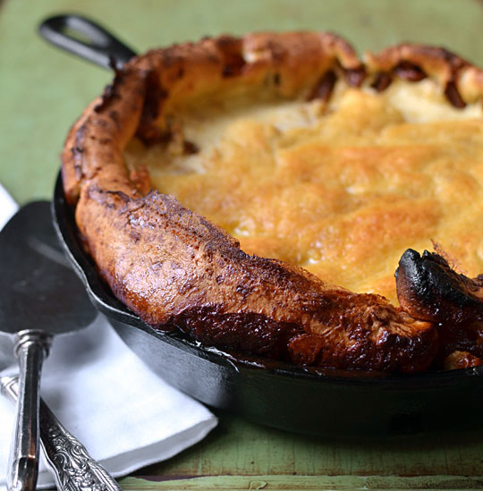

# Apple Pancake

## Ingredients:

  * 2 large or 3 medium apples, preferably tart ones like Granny Smith
  * 4 tablespoons white sugar, divided
  * 1 teaspoon ground cinnamon
  * ½ teaspoon ground ginger
  * ⅓ cup unsalted butter
  * ⅓ cup dark brown sugar
  * ¾ cup flour
  * ½ teaspoon salt
  * ¼ teaspoon nutmeg
  * 1 cup milk
  * ½ teaspoon vanilla
  * 5 eggs
  * Powdered or cinnamon sugar, to serve

## Directions:

1. Heat the oven to 400°F. Peel, core, and quarter the apples, then cut them into medium slices (¼-inch thick or less). Then cut the slices in halves or thirds. You should have about 3 cups of chopped apples.
2. In a small bowl, mix 3 tablespoons of sugar with the cinnamon and ginger and set aside.
3. Cut the butter into chunks and place them in a deep cast iron skillet or 8x8-inch baking dish. Put the skillet or baking dish in the oven for 3 to 4 minutes, or until the butter is melted. Take the pan out of the oven and sprinkle the ⅓ cup brown sugar over the melted butter. Carefully spread the apples on top of the brown sugar and sprinkle the cinnamon sugar mixture over the apples. Put the pan back in the oven to caramelize the apples and sugar.
4. Whisk the flour with the remaining tablespoon of sugar, salt, and nutmeg. Gradually add the milk, whisking constantly with a large wire whisk to beat out any lumps. When the flour is smoothly incorporated into the milk, beat in the vanilla and the eggs one by one. Beat by hand for 2 minutes, or until foamy. Let the batter rest for 5 minutes. By now the sugar should be bubbling around the apples.
5. Take the pan out of the oven and pour the batter over the apples. Bake for about 20 more minutes or until center is set and sides are lightly browned. The pancake will puff up dramatically but fall after a few minutes after you take it out of the oven.

* * *

Original Page: <http://www.thekitchn.com/recipe-weekend-13112>
