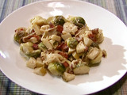

# Brussels Sprouts with Bacon and Blue Cheese

## Ingredients

- 6 slices bacon, cut into 1/2-inch pieces
- 1 small onion, julienned
- 1 teaspoon kosher salt
- 1 small Granny Smith apple, cored and chopped
- 1 recipe Basic Brussels Sprouts, recipe follows
- 1/2 cup heavy cream
- 1 teaspoon whole-grain Dijon mustard
- 1-ounce blue cheese, crumbled
- Pinch freshly ground nutmeg

## Directions

Place the bacon into a 10-inch straight-sided saute pan and set over medium-high heat. Cook bacon until crisp and brown. Remove bacon and all but 1 tablespoon of the fat from the pan using a slotted spoon. Decrease the heat to low. Add the onion and cook just until they turn semi-translucent, approximately 3 minutes. Add the salt and apple and continue to cook for another minute. Add the Brussels sprouts, heavy cream and mustard and cook just until the Brussels sprouts are heated through, approximately 1 to 2 minutes. Remove from the heat and stir in the bacon, blue cheese and nutmeg. Serve immediately.

**Basic Brussels Sprouts**

- 1 pound Brussels sprouts, rinsed
- 1/2 cup water
- 1/4 teaspoon kosher salt

Cut off the stem end of the Brussels sprouts and remove any yellowing outer leaves. Cut each Brussels sprout in half from top to bottom. Place the Brussels sprouts, water and salt into a 3 to 4-quart saucier and cover. Place over high heat and cook for 5 minutes or until tender. Remove and serve immediately.
