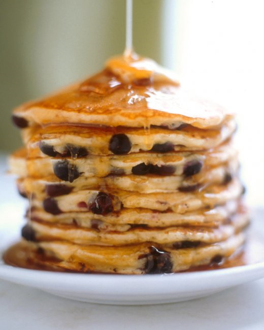

# Buttermilk Pancakes

## Ingredients:

  * 2 cups all-purpose flour  
  * 2 teaspoons baking powder  
  * 1 teaspoon baking soda  
  * ½ teaspoon salt  
  * 3 tablespoons sugar  
  * 2 large eggs 
  * 3 cups buttermilk  
  * 4 tablespoons unsalted butter, melted, plus ½ teaspoon for griddle  

## Directions:

  1. Heat oven to 175°F. 
  2. Whisk together dry ingredients (flour, baking powder, baking soda, and salt) in a medium bowl. 
  3. Whisk together wet ingredients (eggs, buttermilk, sugar, and 4 tablespoons butter) in a seperate bowl (or better, a large measuring cup with a spout). 
  4. Add the wet ingredients to the dry ingredients, whisk together until just combined. Batter should have small to medium lumps.  
  5. Test griddle by sprinkling a few drops of water on it. If water bounces and spatters off griddle, it is hot enough. Using a pastry brush, brush remaining ½ teaspoon of butter onto griddle. Wipe off excess.
  6. Pour half-cup doses of batter on to the pan, in pools 2 inches away from one other. When pancakes have bubbles on top and are slightly dry around edges,  flip over. Cook until golden on bottom.  
  7. Repeat with remaining batter, keeping finished pancakes on a heatproof plate in oven. Serve warm.

## Notes:

- Steps 2 and 3 (measuring and combining the wet and dry ingredients in seperate bowls) can be done ahead of time. It's handy to do this the night before.

* * *

Original Site: <http://www.marthastewart.com/318689/best-buttermilk-pancakes>
