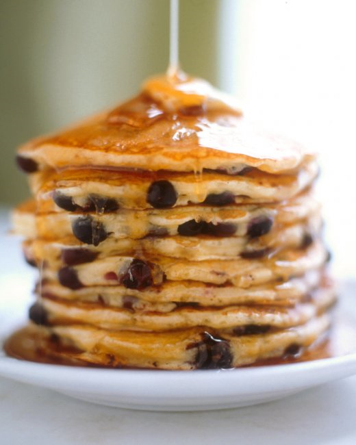

# Buttermilk Pancakes

**Ingredients:**

  * 2 cups all-purpose flour  
  * 2 teaspoons baking powder  
  * 1 teaspoon baking soda  
  * 1/2 teaspoon salt  
  * 3 tablespoons sugar  
  * 2 large eggs, lightly beaten  
  * 3 cups buttermilk  
  * 4 tablespoons unsalted butter, melted, plus 1/2 teaspoon for griddle  

**Directions**

  1. Heat griddle to 375 degrees. Whisk together flour, baking powder, baking soda, salt, and sugar in a medium bowl. Add eggs, buttermilk, and 4 tablespoons butter; whisk to combine. Batter should have small to medium lumps.  
  2. Heat oven to 175 degrees. Test griddle by sprinkling a few drops of water on it. If water bounces and spatters off griddle, it is hot enough. Using a pastry brush, brush remaining 1/2 teaspoon of butter or reserved bacon fat onto griddle. Wipe off excess.  
  3. Using a 4-ounce ladle, about 1/2 cup, pour pancake batter, in pools 2 inches away from one other. When pancakes have bubbles on top and are slightly dry around edges, about 2 1/2 minutes, flip over. Cook until golden on bottom, about 1 minute.  
  4. Repeat with remaining batter, keeping finished pancakes on a heatproof plate in oven. Serve warm.

* * *

Original Page: <http://www.marthastewart.com/318689/best-buttermilk-pancakes>
