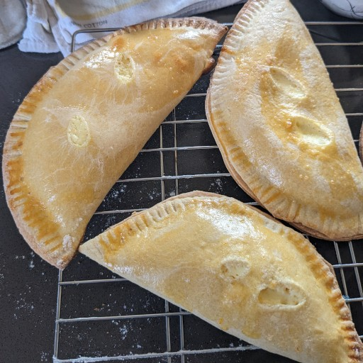

# Casciatelli

My great aunt always made these for Easter. It's a typical Easter treat from Molise. It appears related to the Sicilian Cassatelle. The pastry should be tender but a bit chewy, almost pasta-like. The final pastries are very yellow in color, from the egg wash. The filling has strong orange and mild anise flavor. 

I think these are much, much better when fresh. After a day or so, they lose a lot.

My great aunt told me that back in Monacilioni, they used to make a bit of extra pastry  and they'd make it into horses for the little boys, and dolls for the little girls. They'd bake it, and take it to mass on Easter morning. Before emass, the priest would bless it, and the young children would eat their treats.

## Ingredients:

Pastry:
- 4 cups all purpose flour
- 4 eggs
- 1 stick butter, melted
- 1/3 cup sugar
- 1/4 cup orange juice 

Filling:
- 2 eggs
- 2 lbs. ricotta
- 4 tbsp. sugar
- zest of one orange
- 1 tbsp anisette

Finish:
- 2 egg yolks

## Directions:

1. Pile the flour on your work surface. Make a large well in the middle. Add all the other ingredients to the well.
2. Mix the wet ingredients together with your fingers or a fork. Slowly incorporate all the flour into the mix. Knead by hand until homogeneous. Dough should be firm, not sticky. Add flour off too sticky.
3. Let dough rest for 15 minutes.
4. Knead until smooth.
5. Split into two portions, cover in bowl. Set aside.
6. Combine all ingredients for filling in a large bowl. Mix to combine. Set aside.
7. Roll out one of the portions of dough. If the dough is tough to work with, cover with a towel and rest another 10-15 minutes. Roll to about 2mm thick.
8. Cut into 6-8" rounds.
9. Put a scoop of the filling in the middle of each
10. Fold in half, and crimp with a fork. Cut two vent slits in the top.
11. Place on pan and brush with egg yolk
12. Preheat oven to 375°F
13. Cook for 20 minutes

Notes: 
- when cutting the rounds, there will be scraps. Collect all the scraps, and knead it together with a small pat of butter. When we worked it before with extra flour, it gets tougher. Mixing in some extra fat will tenderize it.
- if the ricotta is loose and watery, drain it first overnight using cheese cloth or a sieve.
