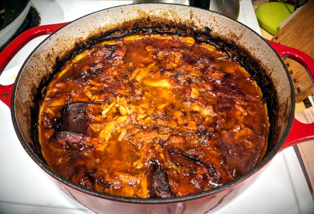

# Cassoulet

In development. Based roughly on [Adam Ragusea's method](https://www.youtube.com/watch?v=g_Huy-0Xeek).

## Ingredients:

* 1/4 lb thick cut bacon, cut into lardon
* 1 lb. bone-in chicken legs, thighs, or leg quarters
* 1 lb. garlicky sausage (e.g., Toulouse sausage, fresh unsmoked kielbasa, fresh bratwurst)
* 1 lb. pork shoulder
* onions, diced
* celery, diced
* carrots, diced
* 4-6 cloves garlic
* 1 lb dried white beans (e.g., cannolini beans)
* 2 tbsp duck fat or lard or butter
* 2 tbsp tomato paste
* 1-2 quarts chicken stock or water + chicken bullion
* 28 g  unflavored gelatin (optional; use if you aren't using home-made stock)
* 2 sprigs rosemary
* 3 sprigs thyme
* 2 bay leaves
* salt and pepper to taste

## Hardware:

- 6 qt. Dutch oven
- Wooden spoon or silicone spatula

## Directions:

1. Soak beans overnight in water
2. Cut bacon into matchsticks, and cook on low heat in dutch oven to render out the fat and brown. Remove and set aside, leaving as much fat in the pan as possible.
3. Brown the meat in batches, then set aside.
4. Add duck fat/lard/butter. Add carrots to pan, cook on low heat for 5 minutes or until just getting soft on the edges.
5. Add onions and celery. Cook on low until soft.
6. Add garlic, cook for 1-2 minutes until fragrant.
7. Add tomato paste, cook for 1-2 minutes.
8. Add meat and accumulated juices back to pot. Drain beans, add to pot. Cover with stock. Add herbs.
9. Bring to a boil. Turn heat down and gently boil for 20-30 minutes.
10. Optionally, bloom gelatin in water.
11. Turn off heat. If using gelatin, stir in and dissolve.
12. Place uncovered in 300 degree oven. Check every half hour to see if beans are sufficiently soft. Top off with water or stock if it gets too low. Adjust seasoning as needed.
13. Remove from oven. Remove herb stems and bay leaves. Rest for 10-20 minutes, and serve.

---

## Notes:

