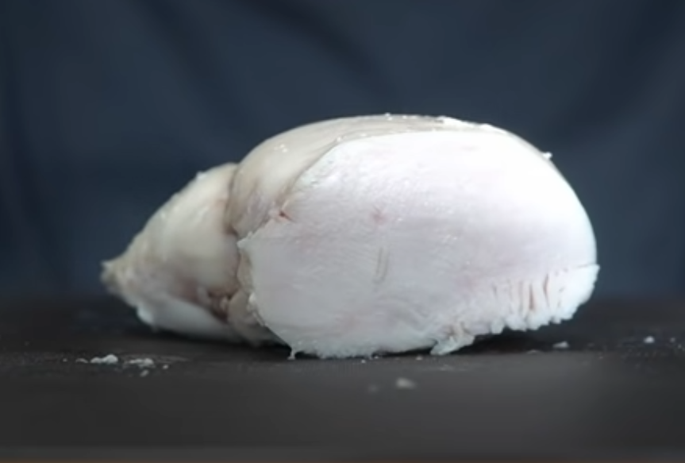

# Chicken Breast "Chashu"

Not really chashu, but a good substitute for a chicken paitan ramen topping, or just to snack on out of the fridge.

This is based on [Way of Ramen's recipe](https://www.youtube.com/watch?v=xwVkNjRmNcw). This recipe uses a technique called an equilibrium brine. Because the brine will be ideal at equilibrium, you can't soak it for too long. The ratios are important--weigh your ingredients! If you want to make more or less, multiply or divide the ingredients exactly to the wieght of the chicken being used. 

This has been part of my weight loss regimen. It's cheap, lean, healthy protein that's filling. When chicken breast is on sale, I buy lots of it, cook this up in individual vacuum-sealed bags, and throw all but one in the freezer. I slice it, and eat slices right out of the fridge, or on salad. I'm usually not a fan of chicken breasts (dark meat is much tastier), as it's not super forgiving to cook and easy to dry out. But this method is fool-proof and satisfying, and has much less salt than deli meat, as well as no sulfites or nitrates, if you're sensitive to those. 

## Ingredients:

  * 1kg (2.2 lbs.) boneless skinless hicken breast
  * 1 L water
  * 50g salt
  * 25 g sugar
  * 1 3"x3" piece of kombu per chicken breast
  * Large bowl of ice water 

## Directions:

  1. Combine water, sugar, and salt in a large vessel. Stir to dissolve.
  2. Place chicken in vessel. Cover and put in the refridgerator overnight. 
  3. Drain chicken, and add each breast to either a vaccuum bag or ziplock bag. Optionally add a square of kombu. Remove air and seal.
  4. Add bags of chicken to the water bath
  5. Set immersion circulator to 145° F, and place in water bath, and set timer for 60-90 minutes
  7. Remove from water bath and transfer bags into ice water until the chicken is at room temperature.
  8. If you're going to eat within 3 days, put in refridgerator. Otherwise freeze bags.
  9. Slice straight from the fridge and eat, or put slices in hot soup to warm up. 
 
---

## Notes
- I did modify this from the original recipe to increase the amount of salt and sugar a bit, because I thought it needed a hair more of both.
- Adding the sheet of kombu to each bag adds a subtle but noticeable umami boost to the dish that makes it more satisfying. If you don't have kombu, you could add MSG to the brine.
