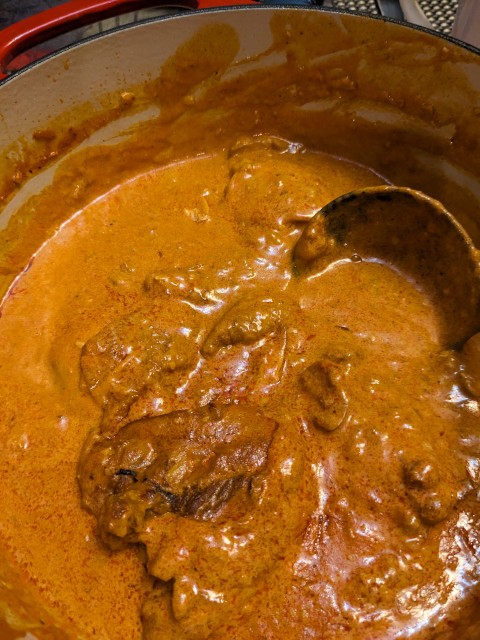

# Chicken Paprikash

Still working on this. Was very good. Could have used a little more cayenne. The original recipe called for some Hungarian hot paprika, but I don't want to maintain another spice in my spice cabinet, so I used more sweet, and mixed with cayenne. Could also have used more garlic -- recipe below adjusted. I'd like to experiment with adding tomatoes; half of all the "traditional" recipes online call for tomatoes or tomato paste, and have call for no tomato product. Texture winds up similar to Chicken Tikka Masala -- I'd bet if I adjusted the spice blend, I could approximate a tikka masala sauce with the same techniques. 

## Ingredients:
- 3 tablespoons lard, chicken fat, or neutral oil
- 4 pounds chicken thighs
- 2 large yellow onions, diced
- 5 cloves garlic, crushed
- 4 tablespoons Hungarian sweet paprika ([I used this](https://www.amazon.com/dp/B004YXNJT8))
- 2 teaspoons smoked paprika
- 1/2 teaspoon cayenne pepper
- 1/2 cup dry white wine
- 2 cups low-sodium chicken stock (home-made would be best)
- 2 tablespoons all-purpose flour
- 1 cup sour cream
- salt and pepper - to taste

## Hardware:
- 6 qt dutch oven
- ~2 qt glass or metal bowl
- Large wooden spoon or silicone spatula
- Whisk

## Directions:

1. Heat pan to medium with cooking fat.
2. Brown thighs in batches, then set aside.
3. Add onion to pan, sweat until soft. 
4. Add garlic to pan, saute until fragrant.
5. Turn heat to low, add paprika, mix into onion garlic mixture.
6. Add wine to deglaze, stir to get any stuck bits are dissolved,
7. Add chicken stock, stir, turn to high.
8. Add chicken and accumulated juices back to pan. 
9. Cover and turn heat down to a simmer for 45-60 minutes.
10. Remove chicken and set aside.
11. Mix flour and sour cream in a bowl, thoroughly to combine. 
12. Temper sour cream: add half a cup of cooking liquid to the sour cream, whisk to combine. Repeat with another half cup 2 more times.
13. Add sour cream mixture to pan, whisk to combine.
14. Bring to a simmer. Taste and season with salt, pepper, and cayenne.
15. Add chicken back to pan, simmer on low for 10 minutes.
16. Serve.

Serve over [spätzle](./Spaetzle.html) or egg noodles. Optionally garnish with sour cream, fresh parsley, and a sprinkle of paprika. 

# Notes

Base recipe here: <https://www.youtube.com/watch?v=JicHsv4v7jQ>
