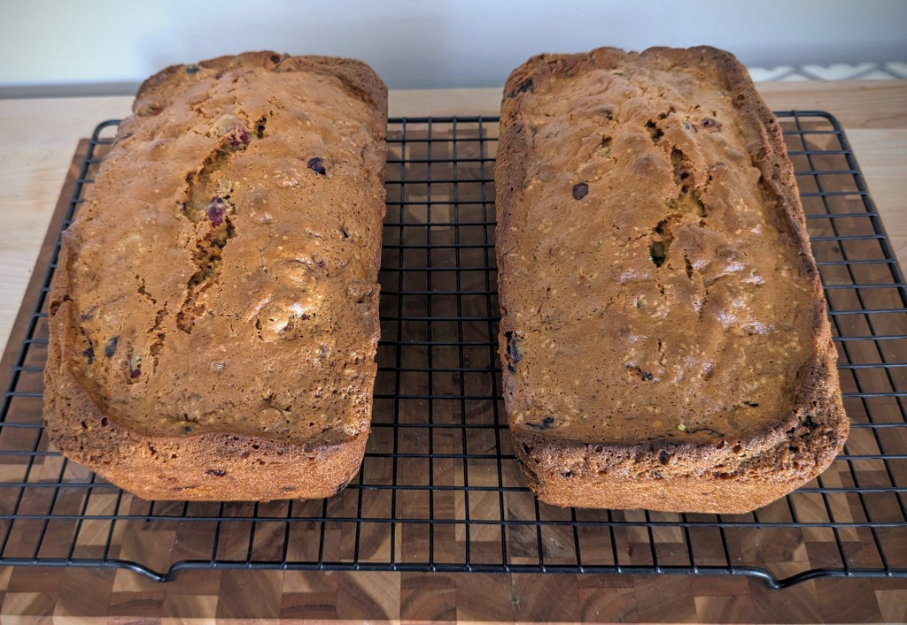

# Cranberry Bread

This is a sweet, muffiny quick bread that my late mother always made for Thanksgiving and Christmas. It is based on the recipe found on [bags Ocean Spray cranberries](https://www.oceanspray.com/en/Recipes/By-Course/Breads-and-Muffins/Classic-Cranberry-Nut-Bread) that's older than I am. The modifications my mother made were as follows:

- vegetable oil instead of shortening
- she beat the tar out of it with an electric mixer, ignoring over-developing gluten per typical best practice with quick breads

I've tried making it using the [muffin method](https://bakinghow.com/the-muffin-method/), and also trying to mix it less so it barely comes together, and it comes out worse. Or at least not the way my mom made it. I'm not sure whether I'm being objective or nostalgic.

## Ingredients:

- 4 cups flour
- 2 cup sugar
- 1 tablespoon baking powder
- 2 teaspoon salt
- 1 teaspoon baking soda
- 1 1/2 cup orange juice
- 2 tablespoon grated orange peel
- 4 tablespoons oil
- 2 egg, well beaten
- 12oz bag fresh cranberries
- 1 cup chopped walnuts or pecans

## Directions:

1. Preheat oven to 350ºF. 
2. Grease 2 loaf pans (9 x 5) with baking spray.
3. In a large bowl, combine flour, sugar, baking powder, salt and baking soda, and whisk to combine. 
4. Add orange juice, orange peel, oil and egg. Mix with electric mixer until smooth.
5. Fold in cranberries and nuts. 
6. Split evenly between loaf pans
7. Bake for 55 minutes or until a toothpick inserted in the center comes out clean.
8. Cool on a rack for 15 minutes. Remove from pan; cool completely. 
9. If making ahead, wrap in foil.
