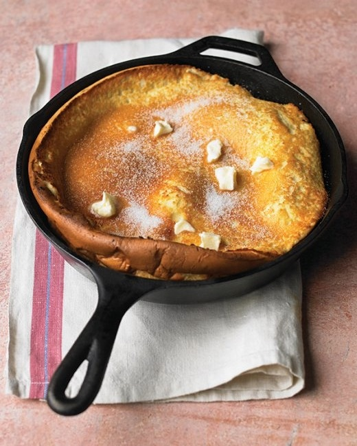

# Dutch Baby Pancake

## Hardware:

  * 12" cast-iron skillet or 10" glass pie pan
  * Bar blender
  * Measuring cups/spoons

## Ingredients:

  * 4 tablespoons butter  
  * 3 large eggs  
  * ¾ cup whole milk  
  * ⅓ cup all-purpose flour  
  * 1 tbsp corn starch[2]
  * ¼ teaspoon salt  
  * 1 teaspoon pure vanilla extract  
  * ¼ cup sugar

## Directions:

  1. Add butter to baking vessel.
  2. Put baking vessel in oven. Preheat oven to 425 degrees.   
  3. In a blender carafe, combine remaining ingredients. Blend until foamy. 
  4. Pour batter into skillet quickly[3]
  5. Bake until pancake is puffed and browned/crispy on edges, about 20 minutes.  
  6. Top with fruit and/or sugar and butter. Slice into wedges, and serve immediately.  

## Additional Suggestions:

**Prep ahead strategy for easy early morning breakfast:**

  1. Pre-measure all wet ingredients[4] and add to blender carafe. Put in refrigerator.
  2. Pre-measure dry ingredients[4] and put in small, resealable container.
  3. Put butter in baking vessel, cover in plastic wrap

**Aaron's favorite topping:**

  1. In a medium-sized microwave-safe mixing bowl, add 1.5 cups fresh blueberries.
  2. Sprinkle ¼ teaspoon cornstarch onto blueberries. Toss to coat evenly.
  3. Add ½ tablespoon butter.
  4. Microwave for 1 minute, 30 seconds. Stir gently. If needed, microwave for additional 30 seconds. Repeat as needed.

* * *

  1. based on [Martha Stewart's dutch baby pancake recipe](http://www.marthastewart.com/333957/dutch-baby-pancake)  
  2. Original recipe called for 1/2 cup flour. Replacing some of the flour with cornstarch makes exterior crispier and interior less mealy.  
  3. Speed is of the essence; you're adding the batter to the hot skillet while it's still in the oven, and you don't want too much heat to be lost  
  4. You should be doing this anyway; step 0 is **always** _mise en place!_  