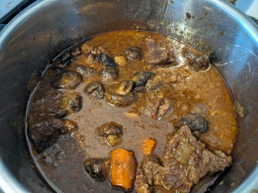

# Instant Pot Irish Beef Stew

This is a really savory, rich, and satisfying beef stew for the Instant Pot or similar pressure cooker. The Guiness, chocolate, and flavored stock add a lot of complex flavor. This is based on [another recipe](https://www.pressurecookrecipes.com/instant-pot-irish-beef-stew/) recommended by a friend, but somewhat modified. I increased the amount of meat by 1lb, because my kids requested it; I trippled the amount of mushrooms, because mushrooms are awesome and full of glutimates, and I halved the amount of Worcestershire sauce, because the original recipe tasted too much of Worcestershire sauce - it has a strong, distinct flavor, and a full tablespoon wasn't needed, especially since we were adding fish sauce. 

I'm looking for ways of streamlining the recipes. Picking out all of the mushrooms and half of the carrots in step 6, and removing the beef in step 7 is time consuming. The increased amount of meat makes it harder to brown; perhaps I should divide it in two and sear both pieces seperately. 

One note about the choice of stock: only use beef stock if it's home-made. Store-bought beef stock makes recipes like this taste like canned soup. If you're going store-bought, use chicken stock.

## Ingredients
- 2-3 pounds chuck steak (1.5 inches thick)
- 1 large onion, roughly sliced
- 1 medium shallot, roughly minced
- 4 medium garlic cloves, roughly minced
- 1-1.5 lb. cremini mushrooms, or other mushrooms you like
- 1 large russet potato, cut into 8 pieces
- 2 medium carrots, cut into chunks
- 1 bay leaf
- 2 sprigs thyme
- 1 sprig rosemary
- 12 grams 70% dark chocolate
- 2 tablespoons (30ml) olive oil
- 1½ tablespoon (12g) all-purpose flour
- 1 cup (250ml) Guinness beer

**Umami Stock Mixture**
- ½ cup (125ml) unsalted chicken or beef stock
- 1/2 tablespoon (8ml) Worcestershire sauce
- 1 tablespoon (15ml) regular soy sauce
- 1 tablespoon (15ml) fish sauce
- 1 tablespoon (16g) tomato paste

## Directions
1. **Prepare the steak:** Pat dry chuck roast, season generously with salt and ground black pepper.  
2. **Brown Chuck Roast Steak:** Heat up Instant Pot by using “Sauté” function. Add enough olive oil to the instant pot to coat the whole bottom. Carefully place seasoned side of chuck steak in Instant Pot. Add chuck to Instant pot. Brown for 10 minutes on each side. Remove and set aside.
2. **Sauté Vegetables:** Add additional oil to Instant Pot if necessary.
    - Add onions and shallots, sauté until softened.
    - Add garlic, sauté for 30 secs until fragrant. 
    - Add mushrooms, sauté for another 5 mins. 
3. **Deglaze:** Pour in the Guinness to deglaze the pot, scraping the bottom with a wooden spoon until the fond is dissolved. 
4. **Pressure Cook Vegetables:** Add Worcestershire sauce, soy sauce, fish sauce, tomato paste, and stock. Mix well. Add bay leaf, thyme, rosemary, dark chocolate, potatoes, and carrots. Pressure cook at high pressure for 6 minutes, then quick release.
5. **Prepare Steak:** While the vegetables are cooking, cut chuck steak into 1 inches cubes. Remove any large hard fat chunks, as those won't completely cook down. Place all cubed beef and meat juice in a large mixing bowl. Toss beef with flour into coat.
6. **Pressure Cook Irish Stew:** Remove half of the carrots and all mushrooms from the pot, then set aside. Add beef and accumulated juices to the pot. Partially submerge the beef in the liquid. Pressure Cook on high pressure for 40 minutes, turn off the heat, and let sit for at least 10 minutes. 
7. **Thicken Stew and Add Vegetables:** Discard bay leaf and the herbs. Remove and set aside beef from the stew. Mash the potatoes and carrots that are in the pot to thicken. Add previously set aside mushrooms and carrots in the pot and stir. Taste and adust seasoning if necessary.

Optionally garnish with chopped parsley, lemon wedges, or a gremolata. 

* * *

Original recipe: <https://www.pressurecookrecipes.com/instant-pot-irish-beef-stew/>
