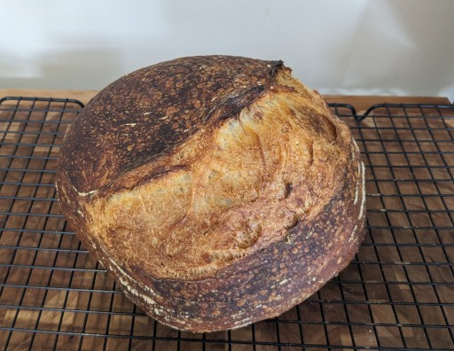

# Basic No-Knead Sourdough

From my dear friend, Kevin. He graciously gave me some of his starter, and this recipe, and I've made it about 4 times now. It's awesome. Converting it here to a recipe format which I can read and parse quickly. Also halved the recipe, as this is too much for me to use at once. Also, I've had better results in my oven with a lower temperature than his recipe called for.

## Ingredients:

- 200-225g ripe, active starter
- 360g bread flour
- 200 mL water
- 2 tsp salt
- additional flour, cornmeal, or semolina to prevent bread from sticking

## Hardware:

- Cast-iron dutch oven
- baking pan
- wire rack
- large mixing bowl
- proofing vessel (e.g., Banneton or similar proofing basket)
- Parchment paper
- Instant-read thermometer

## Directions:

_Day 1 - mix dough_

1. Add starter, flour, and water to mixing bowl. Mix together in a sticky mass.
2. Cover, and sit at room temperature for 30-60 minutes
3. Add salt. Wet hands, fold bread over itself a number of times, gently, trying not to tear the dough.
4. Cover, and sit at room temperature for 30-60 minutes
5. Stretch and fold from 4 sides.

_Days 2-3 - bulk ferment_ 

7. Cover, ferment in the refrigerator for 2 days.

_Day 4 - shape and bake_ 

8. Stretch and fold.
9. Shape dough into boule. Flour top heavily, and cover with towel. Sit at room temperature for 20-30 minutes.
10. Shape additionally as needed. 
11. Flour proofing basket. Add loaf seam-side up into proofing basket.
12. Cover bottom with cornstarch, semolina, or flour. Cover with towel, and sit at room temperature for 3 hours.
13. Place dutch oven and lid into oven. Pre-heat oven to 450°F for 30 minutes.
14. Gently turn over dough onto parchment paper lined with flour, cornmeal, or semolina.
15. Deeply score with sharp knife or kitchen shears.
16. Remove dutch oven from oven. Drop parchement-lined loaf into dutch oven, and cover. Put back in oven.
17. Bake covered for 24 minutes. Check for doneness with instant read thermometer. Should be about 180-190°F internal temperature.
18. Remove from pan, place on cold sheet pan. Add back to oven for 20 minutes, or until crust is deep brown.
19. Cool on wire rack for at least one hour.
