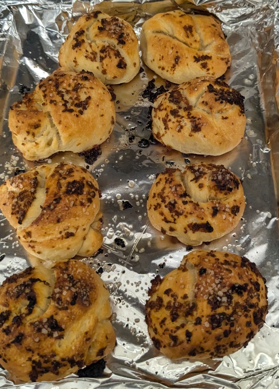

# Pizza

My attempts at home-style pizza, cooked in a pan with lots of olive oil. Very similar to what my nonna made.

---

# Enriched Sourdough Pizza Dough

Based on [Basic No-Knead Sourdough Bread](./Basic%20No-Knead%20Sourdough.html) recipe. Enriched with olive oil, sugar added to make rise faster and better browning. Makes enough dough for pizza in a half sheet pan.

## Ingredients:

- 200-225g ripe, active starter
- 360g bread flour
- 200 mL water
- 1 tsp sugar
- 1 tbsp olive oil
- 2 tsp salt

## Hardware:

- large mixing bowl

## Directions:

_Mix Dough_

1. Add starter, sugar, olive oil, and water to a vessel, and stir into slurry. Sit at room temperature for 30-60 minutes.
3. Add flour and slurry above to mixing bowl, and mix together into a sticky mass.
2. Cover, and sit at room temperature for 30-60 minutes
3. Add salt. Wet hands, fold bread over itself a number of times, gently, trying not to tear the dough.
4. Cover, and sit at room temperature for 30-60 minutes
5. Stretch and fold from 4 sides.
6. Cover, ferment at room temperature until doubled (3-6 hours) or in the refrigerator for up to 2 days in a container coated in olive oil.
7. If fermenting from refridgerator, take out for 30-60 minutes and rest at room temperature. 
8. Stretch and fold.

---

# Home-style Pan Pizza

## Ingredients:

- Enriched Sourdough Pizza Dough
- Olive oil
- Toppings (see notes)

## Hardware:

- half sheet pan

## Directions:

1. Divide if using smaller pans. Shape each portion of dough into boule. Coat lightly with olive oil. rest at room temperature for 20-30 minutes.
2. Liberally add olive oil to baking pan(s). It should be a small, visible pool of oil. You are essentially looking to fry the bottom of the pizza in the pan. work oil into all the sides of the pan so cheese and other ingredients don't stick.
3. Stretch and flatten the pizza dough into the rough shape/size of the pan, and place into the pan. The dough will contract and float around the oil. This is normal.
4. Do your best to stretch it out to the edges of the pan. You will fail.
5. Rest at room temperature for 15 minutes to relax the dough. Do your best to stretch it out to the edges of the pan. Repeat this as many tims as needed.
6. Rest at room temperature for 30-60 minutes, to allow the dough to rise a bit and fill in the gaps. If you have added enough olive oil to the pan, the dough will move freely around and not stick to the bottom.
7. Pre-heat oven to 425°F
8. Top with toppings. 
9. Bake for 20-30 minutes, until toppings are cooked, crust is golden brown on the edges and the bottom.
10. Add finishings. Drizzle with extra-virgin olive oil, fresh basil or other herbs, and salt to taste.
11. Rest for 5 minutes and serve.

## Notes:

- Suggested topings include:
  - Simple pizza sauce (canned tomatoes, olive oil, garlic, oregano, salt), torn chunks of fresh mozzarella, Parmigiano-Reggiano or pecorino Romano. 
  - Quality olive oil, fresh herbs of your choice, sliced garlic, black pepper, salt, red pepper flake, Parmigiano-Reggiano or pecorino Romano. 

--- 

# Garlic Knots

Tasty little dough balls cooked in garlic oil. 

## Ingredients:

- Enriched Sourdough Pizza Dough
- Olive oil
- 8-10 cloves garlic
- Salt

## Hardware:

- half sheet pan

## Directions:

1. Divide into 16 equal pieces. Shape each portion of dough into a small boule. Coat lightly with olive oil. rest at room temperature for 20-30 minutes.
2. Mince garlic and cover in oil in a small bowl. Stir.
3. Lighly brush baking pan with olive oil.
4. Stretch each dough ball into a long snake - 6 inches wide or so
5. Tie each piece into a knot. Roll in garlic oil, and place on pan.
6. Spoon remaining garlic onto knots in pan.
7. Rest at room temperature for 30-60 minutes, to allow the dough to rise a bit
8. Pre-heat oven to 425°F
9. Bake for 25-35 minutes, until crust is golden brown and garlic is cooked.
10. Rest for 5 minutes and serve.
