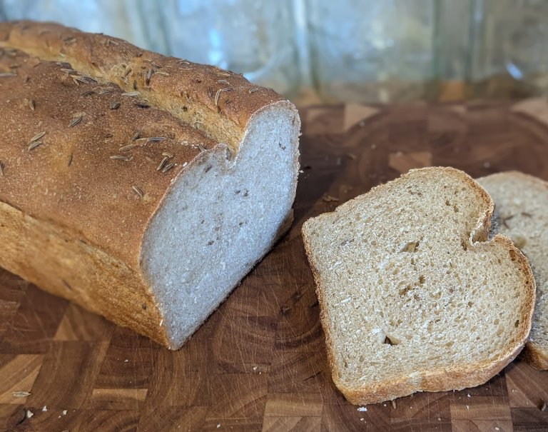
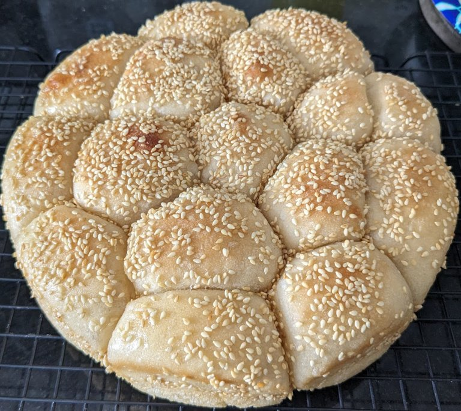

# Sourdough Sandwich Loaf

Adapted from my [Leftover Oatmeal Bread](./Leftover-Oatmeal-Bread.html) recipe, which is a crowd pleaser.

Most sandwich loaves are enriched (i.e., fat added to the dough), often butter. That's messy and a lot of work, especially if, like me, you don't own a stand mixer. This only has butter on the outside to keep the rolls seperate. 

You may need to add more flour—possibly a lot more—to get the dough texture right. It should be smooth and just barely tacky, but not sticky.

## Ingredients:

- ~2 cups bread flour
- 180mL milk (or water)
- 35g sugar (can use maple syrup, honey, brown sugar, etc.)
- 50g sourdough starter or discard
- 5g / 1 tsp salt
- (optional) Sesame seeds

## Hardware:

- large mixing bowl
- bench scraper
- wooden spoon or dough whisk
- 2x loaf pans or larger baking dish

## Directions:

1. In mixing bowl, water, sugar, and sourdough starter together. Let mixture sit on counter for 15 minutes.
2. Add 1 cup of flour and stir to combine into a wet dough, about 1 minute. Add additional flour, mixing well after each addition until the dough comes together into a rough dough. This may take 2 cups, or it may take 3+. Stir until all the flour is incorporated, and the dough is only slightly sticky.
3. Cover, and let sit at room temperature for 30 minutes.
4. Knead for 3-5 minutes on a well-floured work surface. Add more flour as needed to prevent sticking.
5. Cover and let sit at room temperature for 30 minutes.
6. Add salt, and knead on well floured work surface for 3-5 minutes. Add more flour as needed. Dough should not be sticky.
7. Let dough rise until doubled. If you're using discard, this will probably take a while. If you're using ripe starter, this can be done overnight in the fridge, or 1-3 hours at room temperature.
8. Prepare pan by spraying with baking spray, and optionally making a parchment sling for easy removal.
9. Roll into a flat rectangle, with the shorter dimension roughly the size of the pan. Roll up tightly into a cylandar, and tuck in the edges.
10. Optionally, spritz with water and sprinkle liberally with sesame seeds.
11. Sit at room temperature to rise until doubled.
12. Pre-heat oven to 375°F.
13. Put pan in oven for 25 minutes. Check for doneness (should be 200°F). Cook longer if needed.
14. Remove from pan, and cool on wire rack for at least an hour before slicing. 

---

# Rye Sandwich Loaf

This is very similar to the above, with three simple changes:

1. Replace 1/3 of the flour with rye flour.
2. When you flatten the dough to roll it up during the shaping, sprinkle liberally with caraway seeds. Optionally top with caraway seeds.
3. This takes longer to cook. It often takes 40 minutes or so.

---

# Lean Dinner Rolls:

Basically, shaping step is different:

1. Divide into 8-16 portions. 
2. Roll each portion into a tight ball. Roll in melted butter, and place into pan. All the rolls should be touching.
