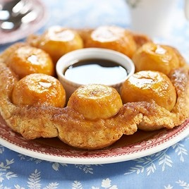

# Peach puzzle

## Ingredients

**Peaches and Syrup**

  * 7   medium peaches, peeled (see note)
  * ¾ cup packed light brown sugar
  * 6 tablespoons water
  * 2 tablespoons unsalted butter
  * ½ tablespoon vanilla extract
  * ⅛ teaspoon salt

**Dough**

  * 1¼ cups all-purpose flour
  * 2 tablespoons granulated sugar
  * 1 tablespoon baking powder
  * ¼ teaspoon salt
  * 5 tablespoons unsalted butter, cut into 1/4-inch pieces and chilled
  * 6 tablespoons milk

## Directions

1. For the peaches and syrup: Adjust oven rack to middle position and heat oven to 400 degrees. Place 6-ounce custard cup or ramekin upside down in center of 9-inch pie plate and arrange peaches around ramekin. Combine brown sugar, water, butter, vanilla, and salt in medium saucepan and stir over medium heat until sugar dissolves and butter melts, about 5 minutes. Pour syrup over peaches.
2. For the dough: Pulse flour, sugar, baking powder, and salt in food processor until blended. Add butter and pulse until flour mixture is pale yellow and resembles coarse cornmeal, five to six 1-second pulses. Turn mixture into medium bowl. (To make dough by hand: Use large holes on box grater to grate frozen butter into bowl with flour mixture, then rub flour-coated pieces between your fingers until flour mixture turns pale yellow and coarse.)
3. Using rubber spatula, fold milk into flour mixture, pressing mixture against sides of bowl to form dough. Squeeze dough together and flatten into disk. On lightly floured work surface, roll dough into 9-inch circle. Lay dough directly over peaches and press dough so that it fits snuggly around peaches. The dough will stretch as you fit it around peaches, but do not attach dough to pie plate. 
4. Place a custard cup or ramekin upside down in the center of a 9-inch pie plate. Arrange the peeled peaches around the cup.
5. Bake until top is golden brown, 25 to 30 minutes. Cool on rack for 30 minutes.
6. Place large rimmed serving plate over top of pie plate and quickly invert Puzzle onto plate. Cut into wedges around each peach and serve, pouring syrup over each portion.

<http://www.cookscountry.com/recipes/Peach-Puzzle/8301/?Extcode=N00PIN000>  

