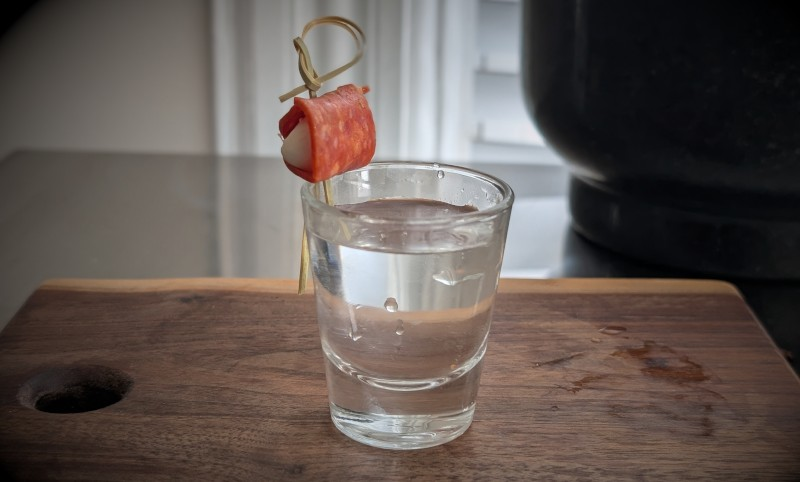

# Shots
# Nonno Alfredo

Named after my great-grandfather, who had a bit of Sambuca in his Italian coffee (dark roast made in a mokka pot) every morning into his 90's. As far as I know, this is my own creation. It's really good, assuming you like coffee and sambuca!

## Ingredients:

- 1 oz Mr. Black, chilled
- 1 oz Sambuca, chilled
## Directions:

1. Add Sambuca to shot glass
2. Float Mr. Black on top
3. Optional: garnish with lemon twist

---

# Staten Island Tapwater

Truly wretched cocktail. I got the idea from Reddit, where someone posted an April fool's cocktail of equal parts every clear liquor in their cabinet. Someone else commented that it should be served in a tall glass and called a Long Island Tapwater. I thought it had more Staten Island vibes. 

## Ingredients:

- 2 oz of equal parts mix of every clear liquor in the cabinet

## Directions:

1. Add mixture to shot glass.
2. garnish with meat-wrapped cheese.

## Notes:

- 4/5/2026:
	- Not nearly as bad as I thought it was going to be. Tasted mostly like Sambuca, strangely enough.
	- Ingredient list: 
		- 99 Bananas schnapps
		- Bacardi white rum
		- Beefeater London dry gin
		- Cointreau
		- Del Maguey Vidal mezcal 
		- Everclear
		- Largo Bay Black Cherry rum
		- Luxardo Maraschino liqueur
		- Malibu coconut rum
		- Platation 3-Star white rum
		- Prairie grapefruit, hibiscus, & chamomile flavored vodka
		- Romana Sambuca
		- Skyy vodka
		- Tanqueray gin
		- Three Olive's Vodka
		- Veil raspberry flavored vodka
